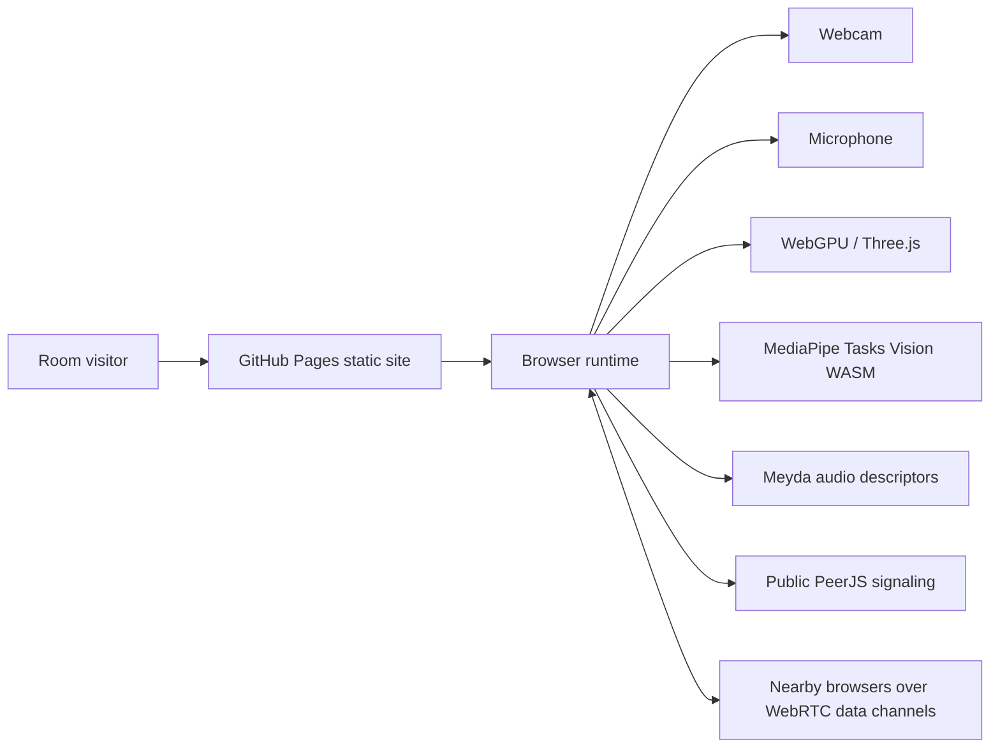

# Room VJ

Live site: https://baditaflorin.github.io/room-vj/

Repository: https://github.com/baditaflorin/room-vj

Support: https://www.paypal.com/paypalme/florinbadita

Room VJ is a browser-based live room visualizer: camera and microphone input feed real-time room sampling, audio-reactive shaders, person-aware distortion, and WebRTC room sync from a static GitHub Pages URL.


## Quickstart

```bash
npm install
make install-hooks
make dev
make test
make smoke
```

## What Works In v0.3.0

- WebGPU WGSL shader renderer with Three.js WebGL fallback.
- Live microphone features with Web Audio and Meyda.
- MediaPipe pose tracking with motion fallback.
- Low-resolution room surface sampling from the webcam feed.
- PeerJS/WebRTC data-channel sync by room code.
- Real-data inference engine with confidence, warnings, and recommended actions.
- Deterministic 10-fixture regression suite for messy room/audio/sync scenarios.
- Full session-state workflow: copy share link, download state, copy state JSON, import state, reset state.
- `?debug=1` overlay plus an in-app debug toggle for inspectable runtime reasoning.
- Diagnostics JSON export for reproducible support reports.
- GitHub Pages deployment from `main` branch `/docs`.
- Public repo and PayPal links in the live UI.
- Version and current public `main` commit visible in the page header.

## Architecture



More detail: docs/architecture.md

## WebRTC infrastructure

Room VJ uses [PeerJS](https://peerjs.com/) for signaling (defaults to peerjs.com's free cloud). For TURN relay — needed when peers can't connect directly through STUN — the browser fetches time-limited HMAC credentials from a token server.

| Repo | Role | Default endpoint |
|---|---|---|
| [turn-token-server](https://github.com/baditaflorin/turn-token-server) | Time-limited HMAC TURN credentials | `https://turn.0docker.com/credentials` |
| [coturn-hetzner](https://github.com/baditaflorin/coturn-hetzner) | TURN relay for cross-NAT peers | `turn:turn.0docker.com:3479` |

Override with `VITE_TURN_TOKEN_URL` at build time or `localStorage["room-vj:turnTokenUrl"]` at runtime. Set the value to an empty string to disable TURN (STUN-only). Implementation: `src/features/sync/turnConfig.ts`.

## Deployment

The site is Mode A: pure GitHub Pages. Build output is committed to `docs/`.

```bash
make build
git add docs
git commit -m "ops: publish pages build"
git push
```

Deployment notes: docs/deploy.md

## Checks

```bash
make lint
make test
make test-fixtures
make smoke
```

`make smoke` builds the app, serves `docs/` exactly like Pages, opens it with Playwright, checks the GitHub/PayPal links, verifies version text, starts demo mode, and downloads a state file.

## Phase 3

Phase 3 completeness notes live at:

- docs/phase3/findings.md
- docs/phase3/plan.md
- docs/phase3/stranger-test.md
- docs/postmortem-phase3.md

## ADRs

Architecture decisions live in docs/adr/.

The most important decisions are:

- docs/adr/0001-deployment-mode.md
- docs/adr/0010-github-pages-publishing-strategy.md
- docs/adr/0017-dependency-policy.md

## Security

Room VJ has no backend and no runtime secrets. Camera and microphone streams stay in the browser. See SECURITY.md and docs/privacy.md.
