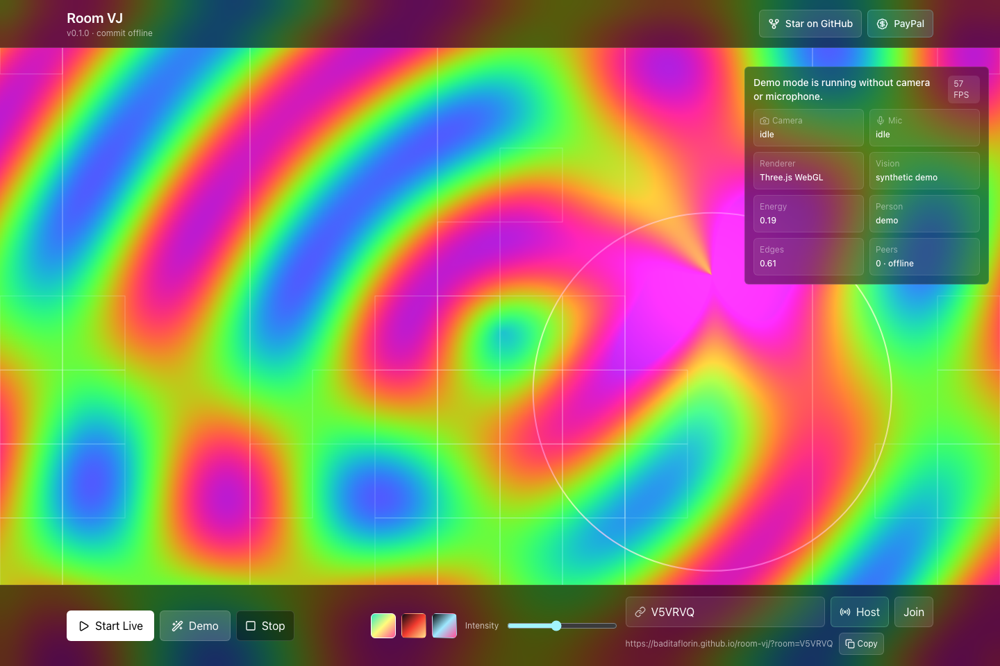
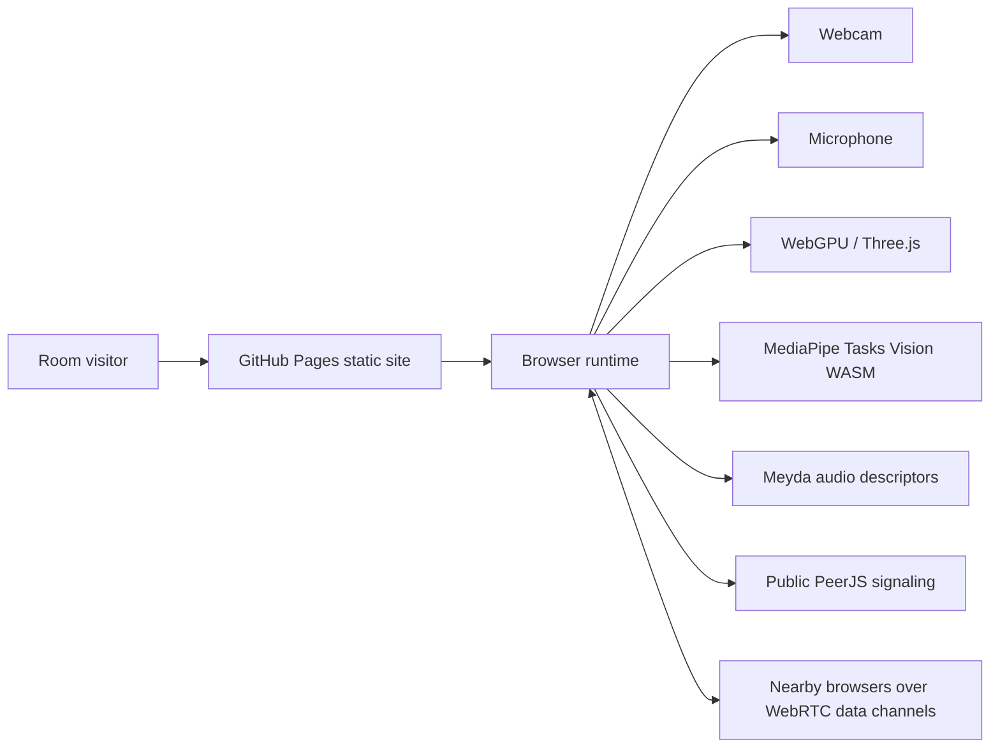

# Room VJ

Live site: https://baditaflorin.github.io/room-vj/

Repository: https://github.com/baditaflorin/room-vj

Support: https://www.paypal.com/paypalme/florinbadita

Room VJ is a browser-based live room visualizer: camera and microphone input feed real-time room sampling, audio-reactive shaders, person-aware distortion, and WebRTC room sync from a static GitHub Pages URL.



## Quickstart

```bash
npm install
make install-hooks
make dev
make test
make smoke
```

## What Works In v0.1.0

- WebGPU WGSL shader renderer with Three.js WebGL fallback.
- Live microphone features with Web Audio and Meyda.
- MediaPipe pose tracking with motion fallback.
- Low-resolution room surface sampling from the webcam feed.
- PeerJS/WebRTC data-channel sync by room code.
- GitHub Pages deployment from `main` branch `/docs`.
- Public repo and PayPal links in the live UI.
- Version and current public `main` commit visible in the page header.

## Architecture



More detail: docs/architecture.md

## Deployment

The site is Mode A: pure GitHub Pages. Build output is committed to `docs/`.

```bash
make build
git add docs
git commit -m "ops: publish pages build"
git push
```

Deployment notes: docs/deploy.md

## Checks

```bash
make lint
make test
make smoke
```

`make smoke` builds the app, serves `docs/` exactly like Pages, opens it with Playwright, checks the GitHub/PayPal links, verifies version text, and starts demo mode.

## ADRs

Architecture decisions live in docs/adr/.

The most important decisions are:

- docs/adr/0001-deployment-mode.md
- docs/adr/0010-github-pages-publishing-strategy.md
- docs/adr/0017-dependency-policy.md

## Security

Room VJ has no backend and no runtime secrets. Camera and microphone streams stay in the browser. See SECURITY.md and docs/privacy.md.
