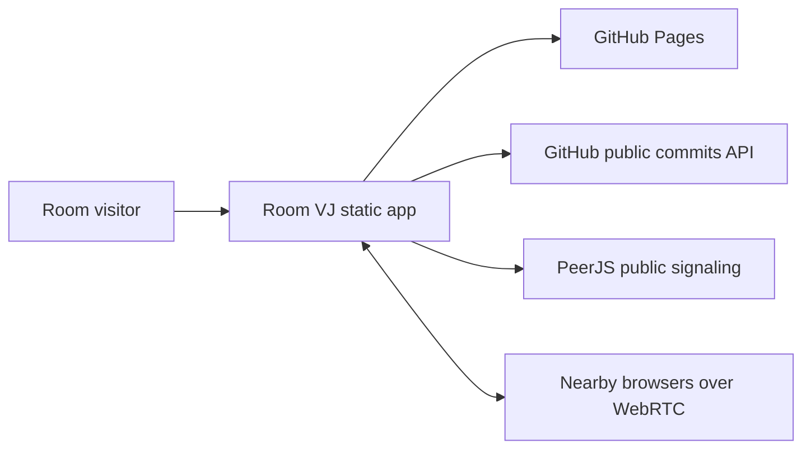
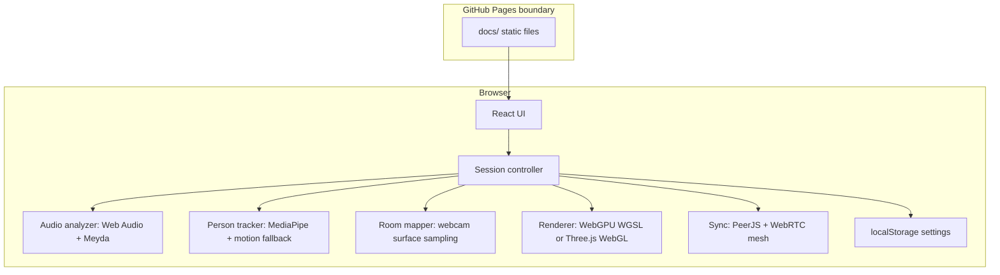

# Architecture

Room VJ is a Mode A GitHub Pages application. Runtime work stays in the browser.

## Context

## Containers

## Module Boundaries

- `src/features/audio/` extracts live music descriptors.
- `src/features/vision/` detects people and movement.
- `src/features/room/` samples coarse room surfaces.
- `src/features/visualizer/` renders shaders.
- `src/features/sync/` manages room links and WebRTC peers.
- `src/features/session/` coordinates browser permissions and frame updates.
